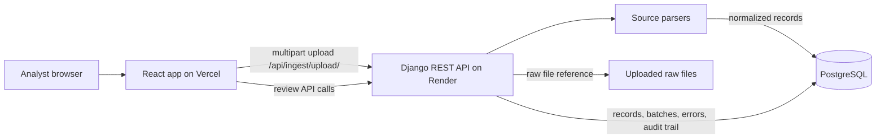
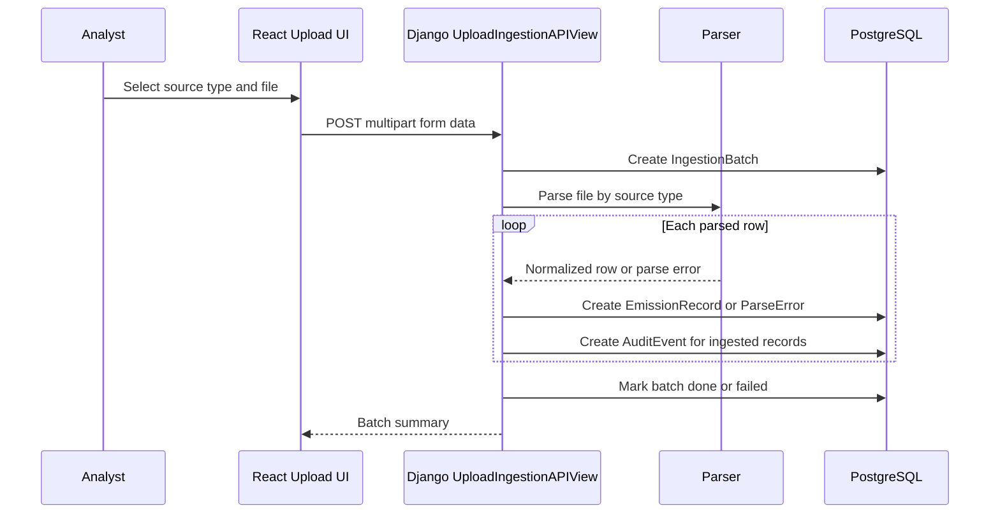
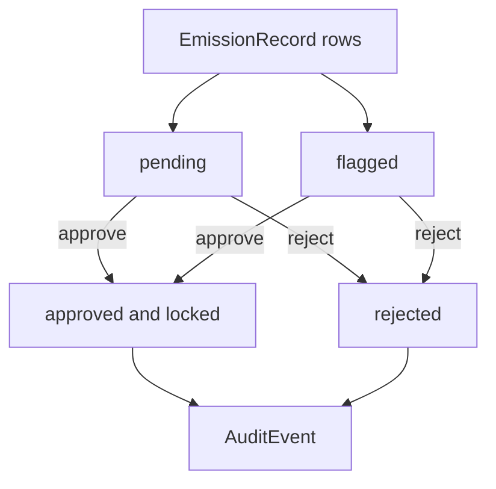
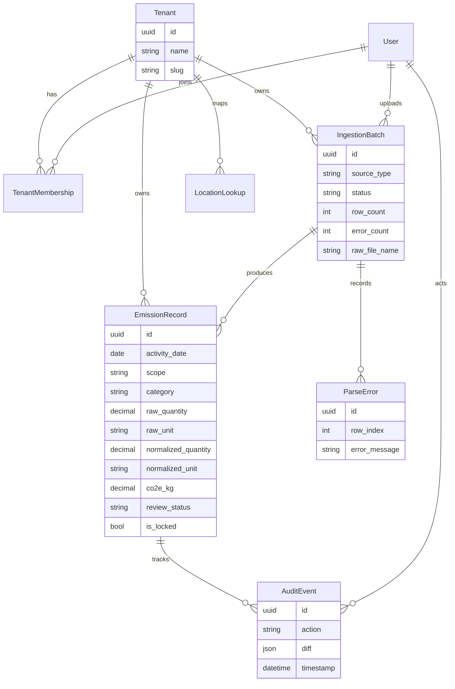
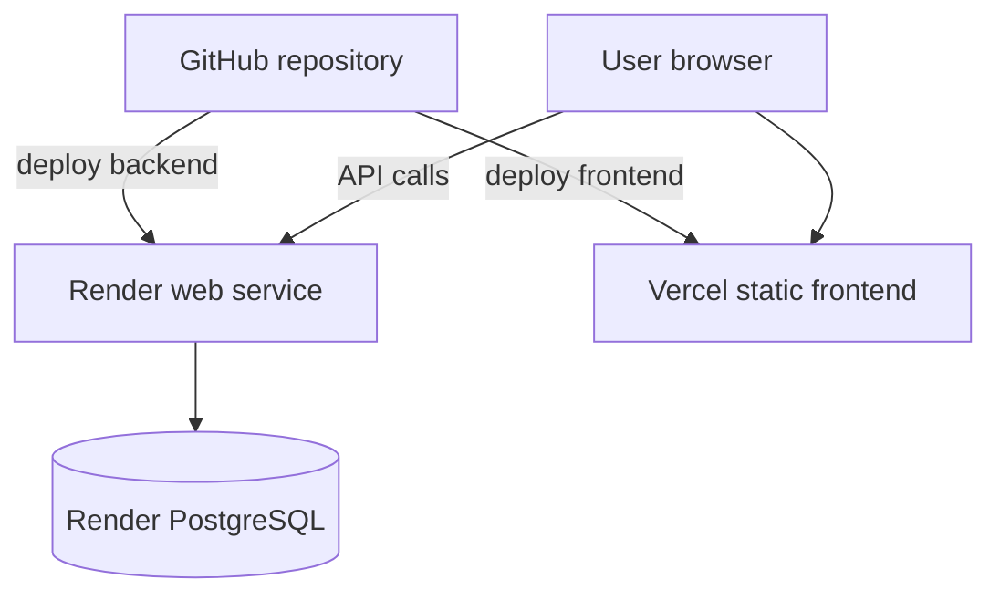

# Architecture

## High-Level System

```mermaid
flowchart LR
    Analyst["Analyst browser"]
    Vercel["React app on Vercel"]
    API["Django REST API on Render"]
    Parser["Source parsers"]
    DB[("PostgreSQL")]
    Media["Uploaded raw files"]

    Analyst --> Vercel
    Vercel -->|"multipart upload /api/ingest/upload/"| API
    API --> Parser
    Parser -->|"normalized records"| DB
    API -->|"raw file reference"| Media
    Vercel -->|"review API calls"| API
    API -->|"records, batches, errors, audit trail"| DB
```

## Ingestion Flow

```mermaid
sequenceDiagram
    participant A as Analyst
    participant UI as React Upload UI
    participant API as Django UploadIngestionAPIView
    participant P as Parser
    participant DB as PostgreSQL

    A->>UI: Select source type and file
    UI->>API: POST multipart form data
    API->>DB: Create IngestionBatch
    API->>P: Parse file by source type
    loop Each parsed row
        P-->>API: Normalized row or parse error
        API->>DB: Create EmissionRecord or ParseError
        API->>DB: Create AuditEvent for ingested records
    end
    API->>DB: Mark batch done or failed
    API-->>UI: Batch summary
```

## Review Flow

```mermaid
flowchart TD
    Records["EmissionRecord rows"]
    Pending["pending"]
    Flagged["flagged"]
    Approved["approved and locked"]
    Rejected["rejected"]
    Audit["AuditEvent"]

    Records --> Pending
    Records --> Flagged
    Pending -->|"approve"| Approved
    Flagged -->|"approve"| Approved
    Pending -->|"reject"| Rejected
    Flagged -->|"reject"| Rejected
    Approved --> Audit
    Rejected --> Audit
```

## Data Model

```mermaid
erDiagram
    Tenant ||--o{ TenantMembership : has
    Tenant ||--o{ IngestionBatch : owns
    Tenant ||--o{ EmissionRecord : owns
    Tenant ||--o{ LocationLookup : maps
    IngestionBatch ||--o{ EmissionRecord : produces
    IngestionBatch ||--o{ ParseError : records
    EmissionRecord ||--o{ AuditEvent : tracks
    User ||--o{ TenantMembership : joins
    User ||--o{ IngestionBatch : uploads
    User ||--o{ AuditEvent : acts

    Tenant {
        uuid id
        string name
        string slug
    }

    IngestionBatch {
        uuid id
        string source_type
        string status
        int row_count
        int error_count
        string raw_file_name
    }

    EmissionRecord {
        uuid id
        date activity_date
        string scope
        string category
        decimal raw_quantity
        string raw_unit
        decimal normalized_quantity
        string normalized_unit
        decimal co2e_kg
        string review_status
        bool is_locked
    }

    AuditEvent {
        uuid id
        string action
        json diff
        datetime timestamp
    }

    ParseError {
        uuid id
        int row_index
        string error_message
    }
```

## Deployment View

```mermaid
flowchart TB
    GitHub["GitHub repository"]
    Render["Render web service"]
    RenderDB[("Render PostgreSQL")]
    Vercel["Vercel static frontend"]
    Browser["User browser"]

    GitHub -->|"deploy backend"| Render
    GitHub -->|"deploy frontend"| Vercel
    Render --> RenderDB
    Browser --> Vercel
    Browser -->|"API calls"| Render
```
