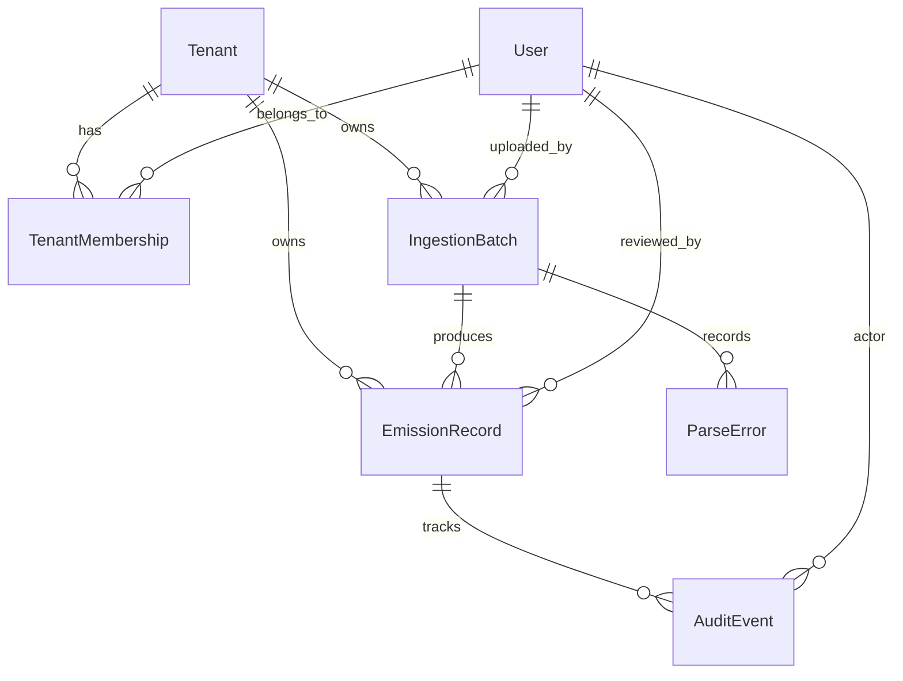

# MODEL.md

## Design Intent

The model is built around a normalized `EmissionRecord`. Each source has a different shape, but once ingested, rows should be comparable by activity date, scope, category, quantity, unit, CO2e value, review status, and audit history.

## Entity Overview

## Tenant

`Tenant` represents a client company. ESG platforms are naturally multi-tenant because each enterprise has its own facilities, plant codes, utility accounts, travel providers, and audit boundaries.

Why it exists:

- Prevents records from different clients mixing.
- Provides a parent for batches, records, memberships, and location lookups.
- Allows future tenant-specific emission factors, mappings, and approval rules.

Current prototype note: ingestion uses a demo tenant called `demo-company`.

## TenantMembership

`TenantMembership` connects Django users to tenants with a role.

Why it exists:

- Supports analyst and admin access per tenant.
- Avoids assuming one user belongs to one company.
- Leaves room for client users, Breathe ESG analysts, and auditor read-only users.

## IngestionBatch

`IngestionBatch` represents one upload or source pull.

Important fields:

- `tenant`
- `source_type`
- `uploaded_by`
- `raw_file`
- `raw_file_name`
- `status`
- `row_count`
- `error_count`
- `ingested_at`
- `completed_at`
- `notes`

Why it exists:

- Preserves source-of-truth context for every import.
- Groups records and parse errors into one analyst-reviewable event.
- Gives the PM and auditors a clear answer to "where did this row come from?"

## EmissionRecord

`EmissionRecord` is the normalized row used by review and audit.

Important fields:

- `activity_date`
- `scope`
- `category`
- `source_type`
- `raw_quantity`
- `raw_unit`
- `normalized_quantity`
- `normalized_unit`
- `co2e_kg`
- `location_code`
- `vendor_or_carrier`
- `description`
- `source_row_id`
- `review_status`
- `reviewed_by`
- `reviewed_at`
- `is_edited`
- `is_locked`
- `flag_reason`

Why it exists:

- Keeps original quantities and normalized quantities side by side.
- Supports Scope 1, 2, and 3 reporting in one table.
- Allows analysts to review suspicious rows without losing source context.
- Locks approved records for audit stability.

## ParseError

`ParseError` stores rows that could not become emission records.

Why it exists:

- Failed rows are still part of the ingestion outcome.
- Analysts can see whether an import failed because of schema, unit, date, or data quality issues.
- Prevents silent data loss.

## AuditEvent

`AuditEvent` records important lifecycle actions for a row.

Current actions:

- `ingested`
- `approved`
- `rejected`
- `edited`

Why it exists:

- Auditors need to know who changed or approved a row and when.
- Approval should not be just a field update with no history.
- The `diff` field allows future edit tracking without redesigning the model.

## LocationLookup

`LocationLookup` maps source-specific location codes to readable location labels and country codes.

Why it exists:

- SAP plant codes and utility meter IDs are not analyst-friendly.
- Location mapping is tenant-specific.
- Location is needed for country/grid-specific factors in a production system.

## Normalization Strategy

The parsers convert source fields into the same target shape:

| Source | Scope | Example category | Normalized unit |
| --- | --- | --- | --- |
| SAP fuel/procurement | Scope 1 | `fuel_combustion` | source unit such as `L` |
| Utility electricity | Scope 2 | `electricity` | `kWh` |
| Corporate travel | Scope 3 | `flight` | `km` |

The prototype uses simple factors:

- Fuel: `quantity * 2.68`
- Electricity: `quantity * 0.708`
- Travel: `distance_km * 0.155`

In production, factors should be tenant, country, fuel type, date, and source specific.

## Why This Model Fits The Assignment

- Multi-tenancy is represented explicitly.
- Source-of-truth tracking is handled through `IngestionBatch`, `source_type`, `source_row_id`, and `raw_file_name`.
- Unit normalization is preserved without destroying raw values.
- Review status and locking support analyst sign-off.
- Audit events support auditor-facing traceability.
